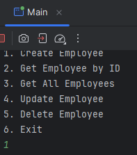
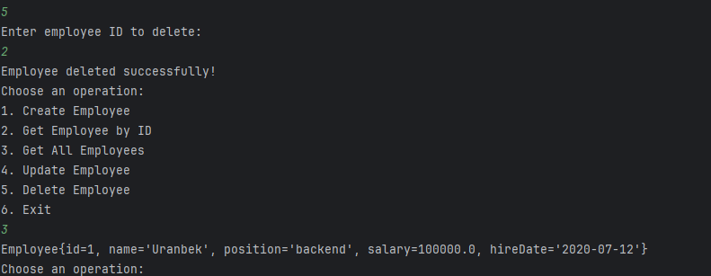

# Employee Management System

## Objective

The objective of this project is to create a Java application that interacts with a relational database to manage employee data. The application implements CRUD (Create, Read, Update, Delete) operations for an `Employee` table using JDBC. It includes an `Employee` entity class and an `EmployeeData` class to handle the database operations.

## Requirements

### Database Setup

1. **Create a relational database** named `employee_db`.
2. **Create a table** `employee` with the following columns:
   - `id` (int, primary key, auto-increment)
   - `name` (varchar)
   - `position` (varchar)
   - `salary` (double)
   - `hire_date` (date)

### Employee Entity Class (`Employee`)

The `Employee` class contains the following fields:
- `id` (int)
- `name` (String)
- `position` (String)
- `salary` (double)
- `hireDate` (Date)

It provides the following:
- Constructors (with and without the `id` field)
- Getters and Setters for each field
- A `toString()` method for easy display of employee information

### EmployeeData Class

The `EmployeeData` class handles CRUD operations on the `employee` table in the database. It includes the following methods:

- `createEmployee(Employee employee)`: Insert a new employee into the `employee` table.
- `getEmployeeById(int id)`: Retrieve an employee’s details from the `employee` table by ID.
- `getAllEmployees()`: Retrieve all employees from the `employee` table.
- `updateEmployee(Employee employee)`: Update an employee’s details in the `employee` table.
- `deleteEmployee(int id)`: Delete an employee from the `employee` table using the employee's ID.

### Database Connection

- JDBC is used to connect to the `employee_db` database.
- The connection is properly managed using try-catch blocks and resource closing.

### Testing

In the `main()` method, the following operations are tested:
1. **Create** a new `Employee` object and insert it into the database using `createEmployee()`.
2. **Read** an employee by ID using `getEmployeeById()` and display their details.
3. **Retrieve and display** all employees using `getAllEmployees()`.
4. **Update** an employee’s details and save them using `updateEmployee()`.
5. **Delete** an employee from the database using `deleteEmployee()`.

---

## ScreenShot

-**Create**: 
-**All**: 
-**ID**: 
-**Update**: 
-**Delete**: 

